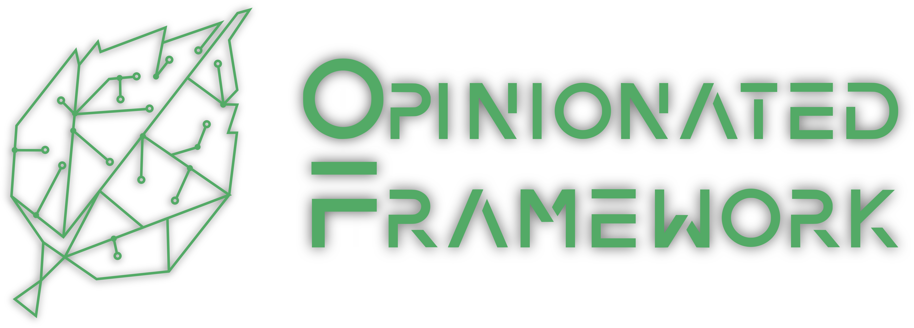

    
    <em>Architectural Clarity, Without the Constraints.</em>

OpinionatedFramework is a robust, comprehensive .NET 10+ framework designed to streamline the development of the application/domain layer. With a strong focus on architectural principles and modern development practices, OpinionatedFramework assists developers in implementing scalable and maintainable software solutions.

**The heart of OpinionatedFramework is our opinionated approach.** We provide a suite of tools that guide and structure the way you develop your application, making design decisions with experience and best practices in mind. This does not limit flexibility, as our core interfaces have default implementations but allow for custom ones.

## Status
### Ensure API 1.0.0 is now launched!
While the rest of the framework remains in active development and is not launched, the Ensure API is now launched. See [documentation](https://github.com/iokode/OpinionatedFramework/tree/main/docs/ensure) and [NuGet page](https://www.nuget.org/packages/IOKode.OpinionatedFramework.Ensuring).

### Active development – Not launched yet
OpinionatedFramework is currently in active development and has not been officially launched yet.

As we are in the active development stage, some features such as the Unit of Work implementations may not be currently available. These features are on our development roadmap and we're diligently working to implement them in upcoming releases.

Additionally, please note that we have not released any NuGet packages yet. We're aiming to make our first release as comprehensive and robust as possible. We appreciate your patience and understanding.

## Why use OpinionatedFramework?
While the usual practice is to keep the application layer independent of the framework, OpinionatedFramework is an exception to the rule. Here's why:

### Don't reinvent the wheel
Starting a new project often means creating foundational interfaces like EmailSender or UnitOfWork in the application layer and implementing them in the infrastructure layer. With OpinionatedFramework, you no longer need to do this. We provide these interfaces out of the box, reducing boilerplate and getting you up and running faster.

### Not coupled to the infrastructure
With OpinionatedFramework, you aren't actually coupled to the infrastructure. Your application layer can remain neutral, giving you the freedom to use your app in a web, mobile, or desktop context without traditional framework dependencies. Need to send emails? You can either use a straightforward SMTP approach or switch to something more custom like MailChimp by simply providing custom implementations of the contracts.

Our default implementations are conveniently placed in a separate package. This means your application layer won't be forced to depend on it. Your infrastructure layer can choose to use these default implementations or easily substitute its own, giving you both flexibility and control over your project's infrastructure.

### Focus on what really matters
OpinionatedFramework simplifies the entire development process. It streamlines your project setup, facilitates architectural decisions, and significantly reduces the time you spend on repetitive tasks, allowing you to focus on building what really matters: your application's unique features.

## Features
OpinionatedFramework comes bundled with a myriad of features:

- **Command**: Implement use-cases with middleware support and scoped services.
- **FileSystem**: Infrastructure-agnostic file system. Local, InMemory and Google Cloud Storage implementations will be available.
- **Persistence**: Incorporate the Unit of Work pattern. NHibernate and MongoDB implementations will be available.
- **Emailing**: Send emails easily, with a default MailKit implementation.
- **Encryption**: Safeguard sensitive data with our encrypter.
- **Events**: Handle domain events effectively.
- **Job Queue**: Manage background tasks efficiently.
- **Job Scheduling**: Plan and schedule tasks effortlessly.
- **Notifications**: Notify users via different channels like email, SMS, Slack, Teams, etc.
- **Logging**: Write logs to multiple streams.
- **Text translations**: Localize your applications easily.
- **Validation**: Validate preconditions, postconditions and invariants.
- **Service Container**: Implement a service container without dependency injection, using a static locator with scope in a command execution.
- **Facades**: Gain easy, static access to contracts.

## Core interfaces
Our core interfaces each have a default implementation, but can also be customized according to your specific needs:

| Contract                                                                                                                                  | Default Implementation                                                                                                                                            |
|-------------------------------------------------------------------------------------------------------------------------------------------|-------------------------------------------------------------------------------------------------------------------------------------------------------------------|
| [`ICommandExecutor`](https://github.com/iokode/OpinionatedFramework/blob/main/src/Foundation/Contracts/ICommandExecutor.cs)               | [`CommandExecutor`](https://github.com/iokode/OpinionatedFramework/blob/main/src/ContractImplementations.CommandExecutor/CommandExecutor.cs)                      |
| [`IFileSystem`](https://github.com/iokode/OpinionatedFramework/blob/main/src/Foundation/Contracts/ICommandExecutor.cs)                    | [`FileSystem`](https://github.com/iokode/OpinionatedFramework/blob/main/src/ContractImplementations.FileSystem/FileSystem.cs)                                     |
| [`IEmailSender`](https://github.com/iokode/OpinionatedFramework/blob/main/src/Foundation/Contracts/IEmailSender.cs)                       | [`MailKitEmailSender`](https://github.com/iokode/OpinionatedFramework/blob/main/src/ContractImplementations.MailKit/MailKitEmailSender.cs)                        |
| [`IEncrypter`](https://github.com/iokode/OpinionatedFramework/blob/main/src/Foundation/Contracts/IEncrypter.cs)                           | [`Aes256GcmModeEncrypter`](https://github.com/iokode/OpinionatedFramework/blob/main/src/ContractImplementations.Aes256GcmModeEncrypter/Aes256Hmac512Encrypter.cs) |
| [`IEventDispatcher`](https://github.com/iokode/OpinionatedFramework/blob/main/src/Foundation/Contracts/IEventDispatcher.cs)               | [`EventDispatcher`]                                                                                                                                               |
| [`IJobEnqueuer`](https://github.com/iokode/OpinionatedFramework/blob/main/src/Foundation/Contracts/IJobEnqueuer.cs)                       | [`JobEnqueuer`]                                                                                                                                                   |
| [`IJobScheduler`](https://github.com/iokode/OpinionatedFramework/blob/main/src/Foundation/Contracts/IJobScheduler.cs)                     | [`JobScheduler`]                                                                                                                                                  |
| [`INotificationDispatcher`](https://github.com/iokode/OpinionatedFramework/blob/main/src/Foundation/Contracts/INotificationDispatcher.cs) | [`NotificationDispatcher`]                                                                                                                                        |
| [`IPasswordHasher`](https://github.com/iokode/OpinionatedFramework/blob/main/src/Foundation/Contracts/IPasswordHasher.cs)                 | [`PasswordHasher`]                                                                                                                                                |
| [`ITextTranslator`](https://github.com/iokode/OpinionatedFramework/blob/main/src/Foundation/Contracts/ITextTranslator.cs)                 | [`TextTranslator`]                                                                                                                                                |
| [`IUnitOfWorkFactory`](https://github.com/iokode/OpinionatedFramework/blob/main/src/Foundation/Contracts/IUnitOfWorkFactory.cs)           | [`UnitOfWorkFactory`]                                                                                                                                             |
| [`ILogging`](https://github.com/iokode/OpinionatedFramework/blob/main/src/Foundation/Logging/ILogging.cs)                                 | [`MicrosoftLogging/Logging`](https://github.com/iokode/OpinionatedFramework/blob/main/src/ContractImplementations.MicrosoftLogging/Logging.cs)                    |

## How to use
Detailed documentation on how to use each feature will be available in our [wiki](https://github.com/iokode/OpinionatedFramework/wiki). Stay tuned!

## Who is using OpinionatedFramework

Nobody yet. Wait to the first release.

## Sponsors
OpinionatedFramework is currently looking for sponsors to support the ongoing development and maintenance of the project. If you are interested in sponsoring, please visit our [Sponsorship Page](https://github.com/sponsors/iokode) for more details.

We appreciate the support of all our sponsors. Your contribution will go a long way in helping us build and maintain this framework for the benefit of all .NET developers!

## Contributors
We love our contributors! Check out the Contributors page to see who has contributed to the project, and find out how you can contribute too.

## License
Source code in this repository and published bytecode in NuGet are licensed under the BSD 2-Clause License. See [LICENSE](https://github.com/iokode/OpinionatedFramework/blob/main/LICENSE) for more information.

Logo image in this repository is licensed under the IOKode Visual Assets License. See [LICENSE_ASSETS](https://github.com/iokode/OpinionatedFramework/blob/main/LICENSE_ASSETS) for more information.

## Contact
For any questions, issues, or feedback, please feel free to file an [issue](https://github.com/iokode/OpinionatedFramework/issues) or open a [discussion](https://github.com/iokode/OpinionatedFramework/discussions).
